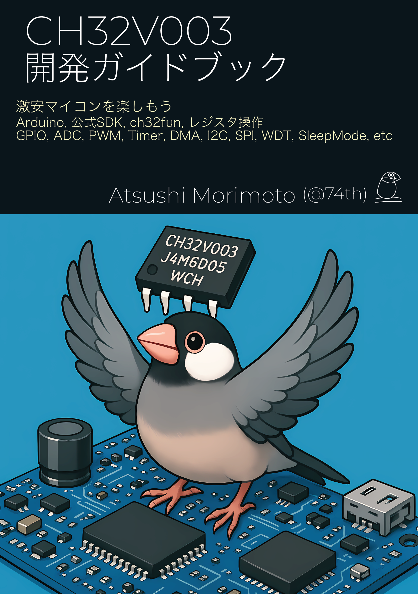

# 同人誌『CH32V003ガイドブック』サンプルコード

本リポジトリは同人誌『CH32V003ガイドブック』のサンプルコードです。

## 書籍について

安価ながら多機能なマイコン、CH32V003の様々な機能を使い尽くための開発ガイドブックです。
CH32V003の基礎知識から、簡単に扱えるArduinoから、全ての機能を使い尽くせる公式SDK、ch32funでの開発方法を解説します。
MCUは多くの機能を持っており、MCUの機能としての解説と、Arduino、公式SDK、ch32fun、レジスタ操作での実装方法を解説します。

> CH32V003開発ガイドブック[74TH-B018] - 74th Books & Gadgets - BOOTH [https://74th.booth.pm/items/6934072](https://74th.booth.pm/items/6934072)

## LICENSE

CC0 1.0 Universal
